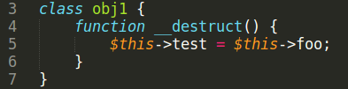
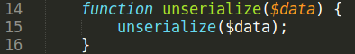
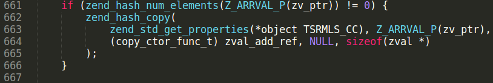
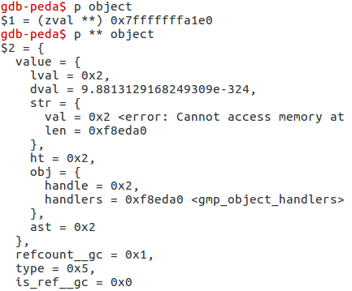
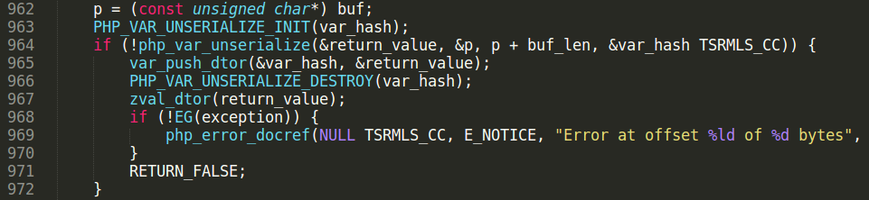
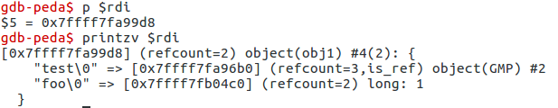
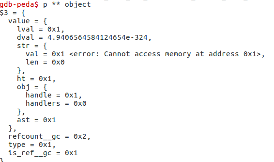
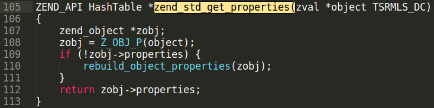
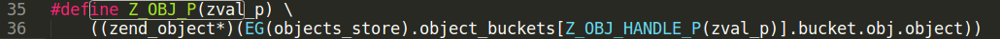
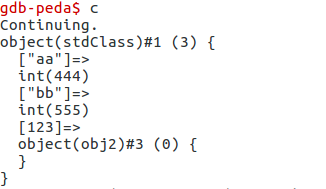

# Unfixed GMP Type Confusion

Requirements: PHP &lt;= 5.6.40\
Compiled with: '--with-gmp'

## Bug summary

Original GMP Type confusion bug was found by taoguangchen researcher and reported \[1\].
The idea of exploit is to change zval structure \[2\] of GMP object during deserialization process.
In original exploit author says about changing zval type using this code lines:
<pre class="western">	function __wakeup()
        {
            $this->ryat = 1;
        }
</pre>

PHP supports serialization/deserialization of references. It is done using "R:" syntax. $this→ryat property is a reference to GMP object. Rewrite of $this→ryat property leads to rewrite of GMP zval.
There are many ways to rewrite zval in PHP, easies is code line like this:
<pre>$this->a = $this->b;</pre>
Part of exploit is to find this line in code of real web-application, and execute it during deserialization process.
Bug in GMP extension was "fixed" as part of delayed \_\_wakeup patch. But source code in gmp.c file was not patched. So bypassing delayed \_\_wakeup would result that this bug is still exploitable. Delayed \_\_wakeup patch was introduced in PHP 5.6.30. Generally it was a patch to prevent use-after-free bugs in unserialize. Exploits using use-after-free bugs are based on removing zval’s from memory in the middle of deserialization process and further reusing freed memory. Introduced patch suspends execution of object’s \_\_wakeup method after deserialization process finishes. It prevents removing zval’s from memory during deserialization process.

But there is another way to execute code in the middle of deserialization in PHP. In PHP there exists Serializable interface \[3\] It is for classes that implement custom serialization/deserialization methods. Deserialization of these classes can not be delayed. They have special syntax in unserialize starting with "C:". In real web-apps "unserialize" methods are small and don’t have code lines to rewrite zval.
<pre class="western">public function unserialize($data) {
	unserialize($data);
}
</pre>
If $data is invalid serialization string (bad format), unserialize($data) call will not throw any fatal error. Deserialization process will continue after unserializing custom-serialized object. This can be used to trigger \_\_destruct method using unclosed brace in serialized $data string. Code of \_\_destruct method will be executed in the middle of unserialization process! In code of \_\_destruct method there is a big chance to find code lines that rewrite zval. The only restriction for this trick is to find a class in web-application code that implements Serializable interface.

## POC debug

Let us run [bug POC](./GMP_type_conf_POC.php) and understand how it works.

Code line to rewrite zval is located in *obj1* class.

Class *obj2* has unserialize method with another unserialize function call in it.

Set two breakpoints in gdb. First, when GMP object is created.\
gdb-peda$ b gmp.c:640

Another breakpoint, where type confusion bug happens.\
gdb-peda$ b gmp.c:661

Rub gdb, unserialization of GMP object properties starts.\
Stop on line 640 and print object zval. It is GMP object with handle = 0x2

Set breakpoint on unserialize call.\
gdb-peda$ b var.c:967\
Continue execution.

Execution reaches second unserialize function call, located in unserialize method of obj2 class.

Because of invalid serialization string (it has “A” char instead of closing bracket at the end), php\_var\_unserialize call returns false and zval\_dtor(return\_value) is called. If the zval\_dtor argument has object type, it’s \_\_destruct method executes.

Output return\_value using printzv macros. It is object of *obj1* class with unserialized properties.

Now destructor of obj1 class executes.

$this-&gt;test is reference to GMP object in serialized string, writing into $this-&gt;test rewrites zval of GMP object. Value to write is taken from $this→foo and equal to **i:1;**

Continue execution.

See what happened with GMP zval.

Handle of GMP zval is equal to $this→foo, it is 0x1.
See what function zend\_std\_get\_properties does.

\#define Z\_OBJ\_HANDLE\_P(zval\_p) Z\_OBJ\_HANDLE(\*zval\_p)\
\#define Z\_OBJ\_HANDLE(zval) Z\_OBJVAL(zval).handle\
\#define Z\_OBJVAL(zval) (zval).value.obj

Z\_OBJ\_HANDLE\_P(zval\_p) returns zval\_p.value.obj.handle it is an object handle taken from zval structure. Z\_OBJ\_P macro takes a object handle number, and returns property hashtable of object with the given handle number. zend\_hash\_copy copies props of GMP object into this hashtable.
GMP handle number is fully controlled from exploit. Using this bug an attacker can rewrite props of any object in PHP script.\
GMP handle is overwritten with 0x1. In the POC script, *stdClass* object created before unserialize call has handle = 0x1. Properties of this object are overwritten, see it in GDB.

To write 0x1 into handle id, sometimes no need to use integer zval, attacker can use boolean type. PHP boolean type is represented in memory as 0 or 1 integer. Code lines like $this→prop = true are more common in real code than property assignment demonstrated previously.\
Usage of this bug in the real-world CMS / frameworks demonstrated in another advisory.

References:

\[1\] <u><https://bugs.php.net/bug.php?id=70513></u>\
\[2\] <u>[https://www.phpinternalsbook.com/php5/zvals/basic\_structure.html](https://www.phpinternalsbook.com/php5/zvals/basic_structure.html)</u>\
\[3\] <u><https://www.php.net/manual/en/class.serializable></u>