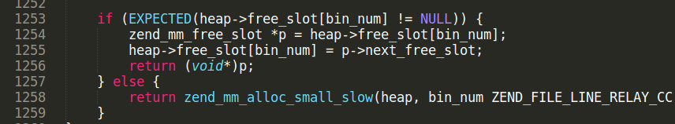
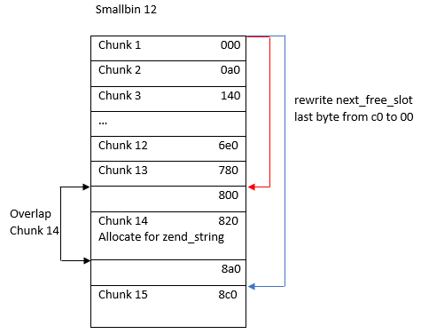
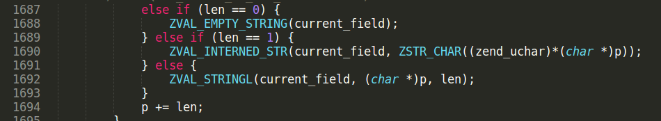
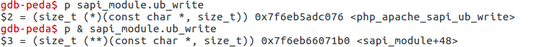

# CVE-2022-31626 analysis

Some weeks ago researcher with nick [cfreal](https://twitter.com/cfreal_) reported a bug in PHP mysqlnd package. The vulnerability is heap-based buffer overflow located in function that handles legacy mysql auth method. The bug was pacthed in PHP 7.4.30 with this commit [https://github.com/php/php-src/commit/58006537fc5f133ae8549efe5118cde418b3ace9](https://github.com/php/php-src/commit/58006537fc5f133ae8549efe5118cde418b3ace9).\
In real web-applications there are some cases where attacker can set arbitrary database server: CMS install scripts or remote database administration scripts. This article considers remote exploitation of this vulnerability in case of simple script for remote database administration.\
Research was done independently of [cfreal\_](https://twitter.com/cfreal_), exploit PoC was [published](https://twitter.com/cyberguru007/status/1539757422490820610) some hours before his talk at Typhoon Con 2022 :)

PoC created for PHP7 configured as Apache2 module. Built with following Configure Command:
<pre> './configure' '--with-bz2' '--with-zlib' '--with-apxs2=/usr/local/apache2.4/bin/apxs' '--with-mysqli=mysqlnd' '--enable-pdo' '--with-mysql=mysqlnd' '--with-pdo-mysql=mysqlnd' '--enable-sockets' '--enable-mbstring' '--with-curl'</pre>

All files can be downloaded here:
- simple web-app [script](./mysql_admin.php)
- [exploit PoC](./exploit_poc.py)
- [script](./rogue_sql_server.py) for rogue Mysql server

Exploit technique summary:
- need only off-by-one heap overflow bug
- prepare heap using POST parsing
- fastbin attack / arbitrary write
- memory leak using zend_string overlap

### Bug analysis

1. At phase of initialization of mysql connection, memory for pfc→cmd\_buffer.buffer is allocated with mnd\_pemalloc function. mnd\_pemalloc allocates memory for persistent connection. File ext/mysqlnd/mysqlnd_protocol_frame_codec.c

If persistent variable is set to 1, pemalloc\_rel uses \_\_zend\_malloc and allocates memory on glibc heap. Different classes/functions for initialization of mysql connection can set persistent flag to 0 or 1. For example, PDO class always sets persistent to 1. By default pfc→cmd\_buffer.length is 0x1000.

2. At phase of authorization process, server sends auth switch packet, to do auth with “mysql\_clear\_password” method. Client accepts it and sends a clear-text password to server. Here the bug happens.

pfc→cmd\_buffer.length is length of buffer allocated by mysqlnd to store auth packet by default it is 0x1000. packet→auth\_data\_len is length of password sent by client. If length of pfc-&gt;cmd\_buffer.buffer is not enough to store received password, new buffer is allocated using mnd\_emalloc. mnd\_emalloc uses memory on PHP heap.

3. 

We want buffer to be located on PHP heap (not glibc heap). For allocating memory with mnd\_malloc, send password with length &gt; 0x1000. Set p pointer to buffer pointer shifter by MYSQLND\_HEADER\_SIZE (4 bytes) and copy packet→auth\_data\_len bytes to it. We overwrite 4 bytes after buffer pointer.\
Note, that fourth byte is always null-byte because client sends null-terminated password string.

### PHP memory manager

To create exploit for heap overflow some knowledge about PHP memory manager can help.\
In PHP 7 allocator, compared to glibc allocator, there is no size/prev\_size metadata for freed blocks, and no forward/backward consolidation.
- To store memory block of small size (less than 3072), PHP uses approach similar to glibc fastbin. Free memory blocks of same size are stored in singly linked list using zend\_mm\_free\_slot structure.

- Memory blocks greater than 3072 bytes are stored on pages. One page is 4096 bytes, memory block can occupy multiple pages, it’s size is rounded to be multiple to page size. Page address is aligned to 0x1000. When storing buffer on multiple pages, last page can have some unused memory. For example memory block with size 0x1f00 takes two pages, last page has 0x100 unused bytes. Pages are stored in a chunk, one chunk has 512 pages.

For more documentation about PHP 7 allocator visit some links [\[1\]](https://github.com/pangudashu/php7-internal/blob/master/5/zend_alloc.md) [\[2\]](https://blog.csdn.net/onlymayao/article/details/104861371).

Use fastbin attack technique for PHP allocator. With the bug we can overwrite at most 4 bytes, fourth byte is always null-byte. next\_free\_block points to next free memory block in linked list and has address like: 0x00007f8b822c9640. We search for a way to build stable exploit without bruteforce, and bypass ASLR. Address overwrite options:
- Rewrite 1 byte:  0x00007f8b822c96**00**   
- Rewrite 2 bytes: 0x00007f8b822c**0041**  
- Rewrite 3 bytes: 0x00007f8b82**004141**  
- Rewrite 4 bytes: 0x00007f8b**00414141**  

We can’t predict address on the server where smallbin page is allocated, so straight forward way to bypass address randomization is to rewrite only one last byte (with null-byte). So we reduce 4-byte overflow into off-by-one overflow.\
Large chunk address is aligned to 0x1000 and size is roundedto be multiple to 0x1000. Last taken page can have some unused memory after buffer, and overflow will write into this unused memory, that gives nothing for attack. To remove the extra space after buffer, we make buffer size multiple to 0x1000. In this case writing beyond buffer writes into next page. 
The only way to rewrite next\_free\_block pointer is to place page allocated for smallbin linked list, exactly right after pages allocated for mysql password, and send password with length that is multiple of the page size. Next step is to prepare PHP heap in the state, where memory block for password will be always allocated right **before** memory block for smallbin.

How to prepare heap for PHP web application? Web application accepts http-requests, and does some actions for parsing GET/POST/COOKIE variables.

### Prepare heap using POST parsing

After some debugging, find code lines where memory is allocated for POST vars. PHP does three memory allocations for parsing one POST var. File: php-7.4.29/main/php\_variables.c line 320

This allocation is temporary, after parsing chunk is freed on line 328.\
File: php-7.4.29/ext/filter/filter.c Line 464

And line 474

Two other allocations take memory for string an release it when script shutdowns.\
Send many POST vars to allocate pages. Code from Python script.

  
When POST parsing starts, many smallbins are empty, and taking memory from empty smallbins result in allocation of new pages for smallbin linked lists. File php-7.4.29/Zend/zend\_alloc.c

Send POST vars to take memory from smallbin 12. Memory with sizes 129 to 160 taken from this bin.

File php-7.4.29/Zend/zend\_alloc\_sizes.h

After allocation of memory for POST vars, another trick works. We can free taken memory when set again same keys with other values. Memory for old values is freed.

State of chunk pages before POST parsing:

State of chunk pages after POST parsing:

Page marked with red is taken for smallbin 12.\
You can notice that memory allocated for POST variables, placed before this smallbin, is free now. Next stages of PHP script after POST parsing are lexical analysis, Zend VM opcodes compiling. They take some free pages. In our case, the script has \~50 lines of code so it doesn’t take much memory for parsing.\
State of pages right before allocation memory for mysql password:

Now allocate memory for mysql password.

When searching memory for large blocks, PHP7 allocator uses best fit algorithm. Start page is searched to fill the most suitable gap. File php-7.4.29/Zend/zend\_alloc.c

Allocator has “gaps” of free pages with different length (5,2,9,309).

Send password with length 0x8ffd and take “gap” started in page 192 (it has most suitable length, 9 pages).

0x7f6eac6c0004 – buffer pointer\
0x7f6eac6c9000 – smallbin page starts

### Fastbin attack and memory leak

Now we can overwrite last byte of next\_free\_slot with null. Before getting code execution, exploits always do memory leak. To get memory leak we need to modify PHP variable structure in memory. The most suitable structure for this is "zend\_string" [\[3\]](https://www.phpinternalsbook.com/php7/internal_types/strings/zend_strings.html). 

File php-7.4.29/Zend/zend\_types.h:

In PHP7 the string content is appended to the end of zend\_string structure. Overwrite “len” value and output variable with “echo”. Structure overwrite can be achieved with heap overlapping techniques. Dump smallbin 12 linked list:

Smallbin was prepared at stage where POST variables were parsed. Notice that 0x7f6eac6c9000 points to 0x7f6eac6c98**c0**.\
After off-by-one overflow:

Block 0x7f6eac6c9000 now points to 0x7f6eac6c98**00.** Consider how free blocks are located in memory.

Allocation of memory in 0x7f6eac6c9800 leads to chunk 14 overlap.\
Now we need to take some values from smallbin. Don’t forget we have opened mysql connection with a server we fully control. PHP mysqlnd client has many emalloc calls in code that parses answer from server to SELECT command. Just read Mysql protocol description to write rogue mysql server [\[4\]](https://dev.mysql.com/doc/internals/en/com-query-response.html).
File php-7.4.29/ext/mysqlnd/mysqlnd\_wireprotocol.c:

Use ZVAL\_STRINGL macro to allocate memory blocks of any size. Code from Python exploit

Allocate memory for zend\_string structure.

Overlap memory block:

zend\_string structure is changed! Now we can leak pointers from heap.

### Getting code execution.
Use fastbin attack again. Prepare fake \_zend\_mm\_free\_slot structure, make next\_free\_slot point to this structure.\
Do some allocations until new next\_free\_slot address is returned.\
Now search for pointers to overwrite for getting code execution. Good target is PHP output buffering mechanism. It works every time some data is outputed into web-page (for example, with "echo" or "var_dump") [\[5\]](https://segmentfault.com/a/1190000015836558). In PHP output buffering is done using SAPI modules. Apache2 has it's own SAPI module [\[6\]](https://developpaper.com/in-depth-explain-how-php-and-web-server-interact/), located in file php-7.4.29/sapi/apache2handler/sapi_apache2.c

File php-7.4.29/main/output.c:

If output buffering is not disabled (in case of Apache2), output will be processed by output handler.

context.out.data is string passed for output. sapi\_module.ub\_write is callback located in global array, it is good target for overwrite.\
Set breakpoint on php\_output\_op function and see how execution goes.

RCX points to system and RDI has string with bash command. We did it!

### References

\[1\] [https://github.com/pangudashu/php7-internal/blob/master/5/zend_alloc.md](https://github.com/pangudashu/php7-internal/blob/master/5/zend_alloc.md)\
\[2\] [https://blog.csdn.net/onlymayao/article/details/104861371](https://blog.csdn.net/onlymayao/article/details/104861371)\
\[3\] [https://www.phpinternalsbook.com/php7/internal_types/strings/zend_strings.html](https://www.phpinternalsbook.com/php7/internal_types/strings/zend_strings.html)\
\[4\] [https://dev.mysql.com/doc/internals/en/com-query-response.html](https://dev.mysql.com/doc/internals/en/com-query-response.html)\
\[5\] [https://segmentfault.com/a/1190000015836558](https://segmentfault.com/a/1190000015836558)\
\[6\] [https://developpaper.com/in-depth-explain-how-php-and-web-server-interact/](https://developpaper.com/in-depth-explain-how-php-and-web-server-interact/)